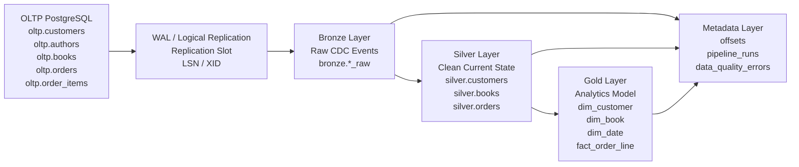

# IC2.10 — End-to-End Architecture Doc

## FantasticBookstore — Medallion + CDC Pipeline

## 1. Project Purpose

The purpose of this project is to design a complete end-to-end data architecture for an online bookstore called **FantasticBookstore**.

The pipeline covers the full data flow from the operational PostgreSQL source system, through CDC-based raw ingestion, into cleaned business tables, and finally into an analytical Gold layer.

The architecture supports:

* PostgreSQL CDC using WAL and logical replication,
* idempotent ingestion into the Bronze layer,
* separation of Bronze, Silver, and Gold layers,
* data lineage and auditability,
* data quality error handling,
* analytical reporting based on a star schema.

---

## 2. Business Scope

The bookstore system includes the following business entities:

* `customers` — bookstore customers,
* `authors` — book authors,
* `books` — books sold by the bookstore,
* `orders` — customer orders,
* `order_items` — individual order lines.

The source operational system is modeled in the following schema:

```sql
oltp
```

The data platform uses the following schemas:

```sql
bronze
silver
gold
metadata
```

---

## 3. High-Level Architecture Diagram



---

## 4. OLTP Layer

The `oltp` schema represents the operational application database of the bookstore.

It contains normalized relational tables with primary keys, foreign keys, and basic business constraints.

OLTP tables:

* `oltp.customers`
* `oltp.authors`
* `oltp.books`
* `oltp.orders`
* `oltp.order_items`

For all source tables, the following setting is used:

```sql
ALTER TABLE <table_name> REPLICA IDENTITY FULL;
```

This allows PostgreSQL to write a fuller representation of changed and deleted rows into the WAL. It is important for CDC because it gives the pipeline enough information to reconstruct `UPDATE` and `DELETE` operations.

---

## 5. Change Data Capture

The pipeline uses PostgreSQL WAL and logical replication as the CDC mechanism.

Each source table change can be captured as one of the following operations:

* `INSERT`
* `UPDATE`
* `DELETE`

Each CDC event contains technical metadata:

| Field           | Meaning                                         |
| --------------- | ----------------------------------------------- |
| `source_slot`   | Name of the replication slot                    |
| `source_lsn`    | WAL Log Sequence Number                         |
| `source_xid`    | PostgreSQL transaction ID                       |
| `source_schema` | Source schema name                              |
| `source_table`  | Source table name                               |
| `operation`     | Type of operation: `INSERT`, `UPDATE`, `DELETE` |
| `raw_change`    | Raw CDC payload from WAL decoding               |
| `change_hash`   | Hash of the raw event payload                   |
| `ingested_at`   | Timestamp when the event was written to Bronze  |

The CDC metadata allows the pipeline to track ordering, source origin, transaction context, and idempotency.

---

## 6. Bronze Layer

The Bronze layer stores raw CDC events.

Its purpose is not to provide clean business-ready data. Its purpose is to preserve the original change events in an auditable and replayable form.

Bronze tables:

* `bronze.customers_raw`
* `bronze.authors_raw`
* `bronze.books_raw`
* `bronze.orders_raw`
* `bronze.order_items_raw`

Each Bronze table contains:

1. CDC metadata,
2. parsed business fields,
3. the original raw CDC payload,
4. event hash,
5. ingestion timestamp,
6. idempotency constraint.

Example idempotency constraint:

```sql
UNIQUE (
    source_slot,
    source_lsn,
    source_xid,
    change_hash
)
```

This protects the pipeline from duplicate ingestion. If the same CDC event is processed again, the database prevents duplicate insertion.

The Bronze layer answers the following questions:

* What exact change was captured?
* Where did it come from?
* What WAL position did it have?
* Which transaction did it belong to?
* When was it ingested?
* Was this event already processed before?

---

## 7. Metadata Layer

The `metadata` schema stores technical control information for the pipeline.

Metadata tables:

* `metadata.cdc_consumer_offsets`
* `metadata.pipeline_runs`
* `metadata.data_quality_errors`

### 7.1 `metadata.cdc_consumer_offsets`

This table stores the last processed LSN for a CDC consumer and replication slot.

It supports:

* resuming processing from the last known WAL position,
* tracking CDC progress,
* reducing the risk of reprocessing old changes,
* operational recovery after failures.

Typical fields:

| Field           | Meaning                                  |
| --------------- | ---------------------------------------- |
| `consumer_name` | Name of the CDC consumer                 |
| `slot_name`     | Name of the replication slot             |
| `last_lsn`      | Last successfully processed WAL position |
| `last_xid`      | Last processed transaction ID            |
| `updated_at`    | Timestamp of the last offset update      |

---

### 7.2 `metadata.pipeline_runs`

This table stores each pipeline execution.

Supported statuses:

* `RUNNING`
* `SUCCESS`
* `FAILED`
* `PARTIAL`

Typical fields:

| Field           | Meaning                        |
| --------------- | ------------------------------ |
| `run_id`        | Unique pipeline run identifier |
| `pipeline_name` | Pipeline name                  |
| `status`        | Current execution status       |
| `started_at`    | Start timestamp                |
| `finished_at`   | Finish timestamp               |
| `rows_read`     | Number of rows read            |
| `rows_written`  | Number of rows written         |
| `rows_failed`   | Number of failed rows          |
| `error_message` | Optional error details         |

This table allows monitoring and troubleshooting of all data pipeline executions.

---

### 7.3 `metadata.data_quality_errors`

This table stores records that failed validation during processing.

Example error types:

* `MISSING_REQUIRED_FIELD`
* `INVALID_STATUS`
* `INVALID_PRICE`
* `INVALID_QUANTITY`
* `INVALID_DATE`
* `INVALID_EMAIL`
* `DUPLICATE_BUSINESS_KEY`
* `FK_NOT_FOUND`
* `PARSE_ERROR`
* `UNKNOWN_OPERATION`
* `SCHEMA_MISMATCH`

The purpose of this table is to avoid silently dropping bad data. Instead, invalid records are logged with source information and raw payload for investigation.

---

## 8. Silver Layer

The Silver layer stores cleaned and validated business data.

Unlike Bronze, which stores event history, Silver stores the current clean state of business entities.

Silver tables:

* `silver.customers`
* `silver.authors`
* `silver.books`
* `silver.orders`
* `silver.order_items`

Each Silver table contains:

* business fields,
* `source_raw_event_id`,
* `source_lsn`,
* `loaded_at`,
* `is_deleted`,
* `deleted_at`.

CDC `DELETE` operations are handled as soft deletes:

```sql
is_deleted = TRUE
deleted_at = <timestamp>
```

This keeps the record available for audit and downstream analysis instead of physically removing it.

Silver layer responsibilities:

* validate required fields,
* validate business domains,
* apply CDC events into the current state,
* handle soft deletes,
* preserve lineage to Bronze,
* prepare data for Gold modeling.

Example validations:

* `order_status` must be one of: `NEW`, `PAID`, `SHIPPED`, `CANCELLED`, `REFUNDED`,
* `segment` must be one of: `RETAIL`, `PREMIUM`, `BUSINESS`,
* `quantity > 0`,
* `price_each > 0`,
* `isbn` must have 13 characters.

---

## 9. Gold Layer

The Gold layer is designed for analytics and reporting.

It does not mirror Silver one-to-one. Instead, it provides a star schema optimized for business questions.

Gold tables:

* `gold.dim_customer`
* `gold.dim_book`
* `gold.dim_date`
* `gold.fact_order_line`

---

### 9.1 `gold.dim_customer`

`gold.dim_customer` is a Slowly Changing Dimension Type 2 table.

It stores historical versions of customer attributes.

For example, if a customer changes segment:

```text
RETAIL → PREMIUM
```

the previous version is not overwritten. Instead:

* the old version receives `is_current = FALSE`,
* the old version receives a `valid_to` timestamp,
* a new current version is inserted with `is_current = TRUE`.

This allows analytical reports to use the customer segment that was valid at a specific point in time.

Key fields:

| Field          | Meaning                          |
| -------------- | -------------------------------- |
| `customer_key` | Surrogate key                    |
| `customer_id`  | Natural business key from Silver |
| `full_name`    | Customer name                    |
| `email`        | Customer email                   |
| `country`      | Customer country                 |
| `segment`      | Customer segment                 |
| `valid_from`   | Version start timestamp          |
| `valid_to`     | Version end timestamp            |
| `is_current`   | Current version flag             |

---

### 9.2 `gold.dim_book`

`gold.dim_book` stores book attributes together with author information.

This dimension denormalizes data from:

* `silver.books`
* `silver.authors`

It contains:

* `book_id`,
* `author_id`,
* `title`,
* `isbn`,
* `genre`,
* `publisher`,
* `author_name`,
* `author_country`,
* `published_at`,
* `list_price`.

This design simplifies reporting because analysts do not need to repeatedly join books with authors.

---

### 9.3 `gold.dim_date`

`gold.dim_date` is a calendar dimension used for time-based reporting.

It contains:

* date key,
* full date,
* year,
* quarter,
* month,
* month name,
* day,
* day of week,
* day name,
* week of year,
* weekend flag.

This supports reports such as:

* sales by day,
* sales by month,
* sales by quarter,
* weekend vs weekday sales,
* yearly revenue trends.

---

### 9.4 `gold.fact_order_line`

`gold.fact_order_line` is the main fact table.

Its grain is:

```text
one order item = one fact row
```

This means that if one order contains three books, the fact table contains three rows.

The table combines data from:

* `silver.orders`,
* `silver.order_items`,
* `gold.dim_customer`,
* `gold.dim_book`,
* `gold.dim_date`.

Key measures:

* `quantity`,
* `price_each`,
* `line_total`.

Key dimensions:

* customer,
* book,
* date,
* order status.

This table supports analytical questions such as:

* What is the revenue by month?
* Which genre sells best?
* Which author generates the most revenue?
* Which customer segment generates the highest revenue?
* How many units were sold per book?

---

## 10. Data Contracts

## 10.1 OLTP → Bronze Contract

| Area                 | Requirement                                                                             |
| -------------------- | --------------------------------------------------------------------------------------- |
| Source               | PostgreSQL OLTP                                                                         |
| Mechanism            | WAL / logical replication                                                               |
| Supported operations | `INSERT`, `UPDATE`, `DELETE`                                                            |
| Output format        | Raw CDC event plus parsed business fields                                               |
| Required metadata    | `source_slot`, `source_lsn`, `source_xid`, `source_schema`, `source_table`, `operation` |
| Idempotency          | `source_slot + source_lsn + source_xid + change_hash`                                   |
| Auditability         | `raw_change`, `change_hash`, `ingested_at`                                              |

---

## 10.2 Bronze → Silver Contract

| Area               | Requirement                                               |
| ------------------ | --------------------------------------------------------- |
| Input              | Raw CDC events from Bronze                                |
| Output             | Clean current business state                              |
| Validation         | Required fields, domain checks, numeric checks, FK checks |
| DELETE handling    | Soft delete using `is_deleted` and `deleted_at`           |
| Error handling     | Invalid records written to `metadata.data_quality_errors` |
| Lineage            | `source_raw_event_id`, `source_lsn`, `loaded_at`          |
| Duplicate handling | CDC event uniqueness handled in Bronze                    |

---

## 10.3 Silver → Gold Contract

| Area              | Requirement                            |
| ----------------- | -------------------------------------- |
| Input             | Clean Silver tables                    |
| Output            | Analytical star schema                 |
| Customer handling | SCD Type 2 in `gold.dim_customer`      |
| Book handling     | Denormalized book + author dimension   |
| Date handling     | Calendar dimension                     |
| Fact grain        | One order item per fact row            |
| Measures          | `quantity`, `price_each`, `line_total` |
| Lineage           | Source LSN fields and load timestamp   |

---

## 11. SLA

Proposed SLA for the FantasticBookstore data pipeline:

| Area                        | SLA                                |
| --------------------------- | ---------------------------------- |
| OLTP → Bronze CDC ingestion | Up to 5 minutes delay              |
| Bronze → Silver processing  | Every 15 minutes                   |
| Silver → Gold processing    | Every 30 minutes                   |
| Gold data freshness         | 30–60 minutes                      |
| Pipeline availability       | 99% monthly                        |
| Bronze retention            | At least 90 days                   |
| Pipeline logs retention     | At least 180 days                  |
| Data quality errors         | Checked after every pipeline run   |
| Recovery                    | Resume from last stored `last_lsn` |
| Duplicate protection        | Required for all CDC ingestion     |

---

## 12. Ownership

| Area                 | Owner                              |
| -------------------- | ---------------------------------- |
| OLTP schema          | Backend / Application Team         |
| CDC configuration    | Data Engineering Team              |
| Bronze Layer         | Data Engineering Team              |
| Silver Layer         | Data Engineering Team              |
| Gold Layer           | Analytics Engineering / BI Team    |
| Data Quality         | Data Engineering Team + Data Owner |
| Business Definitions | Product Owner / Business Owner     |
| SLA Monitoring       | Data Platform Team                 |
| Incident Response    | Data Engineering Team              |

For the FantasticBookstore project:

* business domain owner: **Bookstore Product Owner**,
* technical pipeline owner: **Data Engineering Team**,
* reporting owner: **Analytics / BI Team**.

---

## 13. Monitoring

The pipeline should monitor:

* CDC lag based on the latest processed LSN,
* number of events written to Bronze,
* number of rows loaded to Silver,
* number of rows loaded to Gold,
* number of data quality errors,
* last successful pipeline run,
* pipeline run duration,
* failed pipeline executions,
* duplicate event attempts,
* Gold data freshness.

Monitoring data should be stored or derived from:

* `metadata.cdc_consumer_offsets`,
* `metadata.pipeline_runs`,
* `metadata.data_quality_errors`,
* row counts in Bronze, Silver, and Gold.

---

## 14. Data Quality Rules

Recommended data quality rules:

| Entity      | Rule                                                 |
| ----------- | ---------------------------------------------------- |
| customers   | `customer_id` must not be null                       |
| customers   | `email` must not be null                             |
| customers   | `segment` must be `RETAIL`, `PREMIUM`, or `BUSINESS` |
| books       | `isbn` must have 13 characters                       |
| books       | `price > 0`                                          |
| books       | `author_id` must exist                               |
| orders      | `order_status` must be valid                         |
| orders      | `customer_id` must exist                             |
| order_items | `order_id` must exist                                |
| order_items | `book_id` must exist                                 |
| order_items | `quantity > 0`                                       |
| order_items | `price_each > 0`                                     |

Invalid records should be written to:

```sql
metadata.data_quality_errors
```

---

## 15. Example Analytical Queries

### Revenue by Genre

```sql
SELECT
    db.genre,
    SUM(f.line_total) AS revenue,
    SUM(f.quantity) AS sold_units,
    COUNT(*) AS order_lines
FROM gold.fact_order_line AS f
JOIN gold.dim_book AS db
    ON f.book_key = db.book_key
WHERE f.order_status IN ('PAID', 'SHIPPED')
GROUP BY db.genre
ORDER BY revenue DESC;
```

---

### Revenue by Customer Segment

```sql
SELECT
    dc.segment,
    SUM(f.line_total) AS revenue,
    SUM(f.quantity) AS sold_units
FROM gold.fact_order_line AS f
JOIN gold.dim_customer AS dc
    ON f.customer_key = dc.customer_key
WHERE f.order_status IN ('PAID', 'SHIPPED')
GROUP BY dc.segment
ORDER BY revenue DESC;
```

---

### Revenue by Month

```sql
SELECT
    dd.year,
    dd.month,
    SUM(f.line_total) AS revenue,
    COUNT(DISTINCT f.order_id) AS orders_count
FROM gold.fact_order_line AS f
JOIN gold.dim_date AS dd
    ON f.date_key = dd.date_key
WHERE f.order_status IN ('PAID', 'SHIPPED')
GROUP BY dd.year, dd.month
ORDER BY dd.year, dd.month;
```

---

### Revenue by Author

```sql
SELECT
    db.author_name,
    db.author_country,
    SUM(f.line_total) AS revenue,
    SUM(f.quantity) AS sold_units
FROM gold.fact_order_line AS f
JOIN gold.dim_book AS db
    ON f.book_key = db.book_key
WHERE f.order_status IN ('PAID', 'SHIPPED')
GROUP BY db.author_name, db.author_country
ORDER BY revenue DESC;
```

---

## 16. Implementation Evidence

The following schemas were designed and implemented:

### OLTP

* `oltp.customers`
* `oltp.authors`
* `oltp.books`
* `oltp.orders`
* `oltp.order_items`

### Bronze

* `bronze.customers_raw`
* `bronze.authors_raw`
* `bronze.books_raw`
* `bronze.orders_raw`
* `bronze.order_items_raw`

### Metadata

* `metadata.cdc_consumer_offsets`
* `metadata.pipeline_runs`
* `metadata.data_quality_errors`

### Silver

* `silver.customers`
* `silver.authors`
* `silver.books`
* `silver.orders`
* `silver.order_items`

### Gold

* `gold.dim_customer`
* `gold.dim_book`
* `gold.dim_date`
* `gold.fact_order_line`

Test data was loaded into the Silver layer and then transformed into the Gold analytical model. The Gold layer was validated using analytical queries for revenue by genre, customer segment, month, and author.

---

## 17. Summary

The FantasticBookstore architecture implements a complete medallion and CDC pipeline:

```text
OLTP → CDC / WAL → Bronze → Silver → Gold
```

Key characteristics:

* PostgreSQL WAL and logical replication are used for CDC.
* Bronze stores raw, auditable, idempotent CDC events.
* Metadata tracks offsets, pipeline runs, and data quality errors.
* Silver stores validated current business state.
* CDC deletes are handled through soft delete flags.
* Gold provides a star schema for analytical reporting.
* `gold.dim_customer` supports SCD Type 2.
* `gold.fact_order_line` stores sales facts at the order item level.
* The design includes data contracts, SLA, ownership, monitoring, and quality rules.

This solution satisfies the IC2.10 requirement: documenting a full medallion and CDC pipeline for a bookstore, including diagram, contracts, SLA, and ownership.
