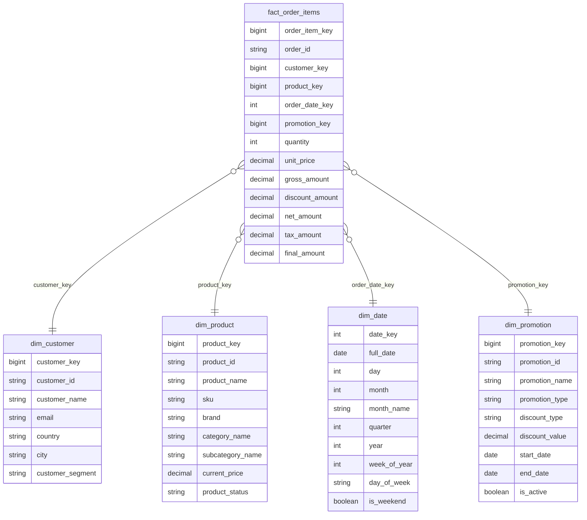

# HW2.1 — Design Star Schema for an E-commerce Domain

## 1. Domain Overview

The e-commerce domain contains the following source entities:

- customers
- orders
- items / order items
- products
- categories
- promotions
- reviews

The analytical goal is to design a dimensional model that allows the business to analyze:

- what customers bought,
- which products were sold,
- how many items were sold,
- when sales happened,
- which promotions were used,
- how much revenue was generated,
- how products were reviewed by customers.

The model is designed mainly as a **star schema**, where fact tables store measurable business events and dimension tables store descriptive context.

---

## 2. Identified Business Processes

The main business processes in this e-commerce domain are:

| Business Process | Description |
|---|---|
| Product sales | A customer buys one or more products as part of an order. |
| Promotion usage | A promotion is applied to an order or order item. |
| Customer reviews | A customer writes a review for a product. |

The most important process is **product sales**, because it is the core revenue-generating activity of the business.

---

## 3. Main Fact Table: `fact_order_items`

### Business Process

Product sales.

### Grain

One row in `fact_order_items` represents:

> one product line within one customer order.

This means that if one order contains three different products, the fact table will contain three rows for that order.

Example:

| order_id | product_id | quantity |
|---|---:|---:|
| 1001 | 10 | 2 |
| 1001 | 25 | 1 |
| 1001 | 38 | 4 |

This grain is chosen because it allows analysis at the product level, customer level, order level, category level, promotion level and date level.

---

## 4. Dimensions for `fact_order_items`

### `dim_customer`

Stores descriptive information about customers.

Possible columns:

- `customer_key` — surrogate key
- `customer_id` — natural/business key from source system
- `customer_name`
- `email`
- `country`
- `city`
- `customer_segment`
- `created_at`
- `updated_at`

Used to answer questions such as:

- Which customers generate the most revenue?
- Which customer segments buy the most?
- Which countries or cities generate the most sales?

---

### `dim_product`

Stores descriptive information about products.

Possible columns:

- `product_key` — surrogate key
- `product_id` — natural/business key from source system
- `product_name`
- `sku`
- `brand`
- `category_name`
- `subcategory_name`
- `current_price`
- `product_status`
- `created_at`
- `updated_at`

In a pure star schema, category information can be denormalized into `dim_product`.  
This avoids extra joins and keeps the model simple for analytical queries.

Used to answer questions such as:

- Which products sell the most?
- Which product categories generate the most revenue?
- Which brands perform best?

---

### `dim_date`

Stores calendar-related information.

Possible columns:

- `date_key`
- `full_date`
- `day`
- `month`
- `month_name`
- `quarter`
- `year`
- `week_of_year`
- `day_of_week`
- `is_weekend`

Used to answer questions such as:

- What is daily, monthly or yearly revenue?
- How does sales volume change over time?
- Are there seasonal sales patterns?

---

### `dim_promotion`

Stores descriptive information about promotions.

Possible columns:

- `promotion_key` — surrogate key
- `promotion_id` — natural/business key from source system
- `promotion_name`
- `promotion_type`
- `discount_type`
- `discount_value`
- `start_date`
- `end_date`
- `is_active`

Used to answer questions such as:

- Which promotions generated the most revenue?
- Which promotions were used most often?
- How much discount was given?

If an order item has no promotion, the fact table can reference a default row such as `No Promotion`.

---

## 5. Facts in `fact_order_items`

Possible columns in the fact table:

| Column | Type | Description |
|---|---|---|
| `order_item_key` | surrogate key | Technical key for the fact row. |
| `order_id` | degenerate dimension | Order identifier kept in the fact table. |
| `customer_key` | foreign key | Reference to `dim_customer`. |
| `product_key` | foreign key | Reference to `dim_product`. |
| `order_date_key` | foreign key | Reference to `dim_date`. |
| `promotion_key` | foreign key | Reference to `dim_promotion`. |
| `quantity` | fact | Number of units sold. |
| `unit_price` | fact | Product price per unit at the time of sale. |
| `gross_amount` | fact | `quantity * unit_price`. |
| `discount_amount` | fact | Discount applied to the order item. |
| `net_amount` | fact | `gross_amount - discount_amount`. |
| `tax_amount` | fact | Tax amount if applicable. |
| `final_amount` | fact | Final amount paid after discount and tax. |

Important note:

Descriptive fields such as `customer_name`, `product_name` or `category_name` should not be stored directly as facts.  
They belong in dimension tables.

---

## 6. Secondary Fact Table: `fact_reviews`

### Business Process

Customer reviews.

### Grain

One row in `fact_reviews` represents:

> one review written by one customer for one product.

### Dimensions

The review fact table can reference:

- `dim_customer`
- `dim_product`
- `dim_date`

### Facts

Possible facts:

| Column | Description |
|---|---|
| `rating` | Numeric rating given by the customer, for example from 1 to 5. |
| `review_count` | Usually fixed value `1`, useful for counting reviews. |
| `helpful_votes` | Number of helpful votes if available. |

Possible structure:

| Column | Type |
|---|---|
| `review_key` | surrogate key |
| `review_id` | degenerate dimension or source identifier |
| `customer_key` | foreign key |
| `product_key` | foreign key |
| `review_date_key` | foreign key |
| `rating` | fact |
| `review_count` | fact |
| `helpful_votes` | fact |

This table allows analysis such as:

- average rating by product,
- average rating by category,
- number of reviews per product,
- relationship between sales and reviews.

---

## 7. Optional Fact Table: `fact_orders`

### Business Process

Order placement.

### Grain

One row in `fact_orders` represents:

> one customer order.

This table is optional because many sales analyses can already be done using `fact_order_items`.

It can be useful when the business wants to analyze order-level metrics.

### Possible Facts

- `order_total_amount`
- `order_discount_amount`
- `shipping_amount`
- `tax_amount`
- `items_count`
- `order_count`

Important warning:

Order-level facts should not be mixed incorrectly with order-item-level facts.  
If `order_total_amount` is stored in `fact_order_items`, it can be duplicated across multiple order lines and cause incorrect revenue calculations.

---

## 8. Conceptual Star Schema

---

## 9. Design Decisions

### Why `fact_order_items` is the main fact table

The order item level is the most useful grain for e-commerce sales analytics.  
It allows the business to analyze revenue and quantity sold by:

- product,
- category,
- customer,
- date,
- promotion,
- order.

If the grain was only one row per order, product-level analysis would be limited or impossible.

---

### Why `order_id` can stay in the fact table

`order_id` can be treated as a degenerate dimension.

It is useful for grouping order lines back into a full order, but it does not require a separate dimension if the order has only a small number of descriptive attributes.

---

### Why categories can be inside `dim_product`

For a star schema, category and subcategory can be stored directly inside `dim_product`.

This keeps the model simple and improves query usability.

If the category hierarchy becomes complex, it could be moved into a separate `dim_category`, but that would make the model closer to a snowflake schema.

---

### Why reviews are a separate fact table

Reviews are not part of the sales transaction itself.  
They are a separate business process with a different grain.

Sales fact grain:

> one product line within one order.

Review fact grain:

> one review written by one customer for one product.

Because the grains are different, reviews should not be stored directly in `fact_order_items`.

---

## 10. Final Summary

The proposed dimensional model contains one main fact table and one secondary fact table:

### Main fact table

- `fact_order_items`

### Secondary fact table

- `fact_reviews`

### Optional fact table

- `fact_orders`

### Main dimensions

- `dim_customer`
- `dim_product`
- `dim_date`
- `dim_promotion`

The main grain of the sales model is:

> one row per order item / order line.

This design supports core e-commerce analytics such as sales by product, customer, category, promotion and time.
